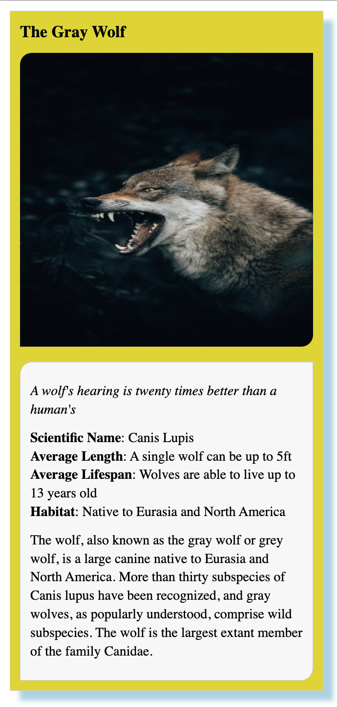

# Animal Trading Cards

## Project Overview

This project is part of the **Udacity Front-End Web Developer Nanodegree**. It focuses on applying HTML and CSS skills to create a trading card for an animal. The goal is to replicate a design prototype and apply custom information about a chosen animal to create a visually appealing and informative card.

## Features

**Custom Animal Data:** Each card displays information about an animal, including its name, picture, and interesting facts.
**Responsive Design:** Crafted to ensure the trading card is visually appealing across different devices and screen sizes.
**Styling with CSS:** Utilizes CSS to style the page according to the design prototype provided by Udacity, with personal touches added for uniqueness.

### Technologies Used

* HTML5
* CSS3

#### Project Structure

```
01_Animal_Trading_Cards
│   README.md
│   card.html    
│
└───css
│   │   styles.css
│   
└───images
    │   animalImage.jpg
```

#### Result




#### Getting Started

**Prerequisites**

A modern web browser capable of rendering HTML5 and CSS3.

**Installation**

Clone the repository to your local machine.
```bash
git clone https://github.com/amnotme/Udacity_FEND.git
```
Navigate to the `01_Animal_Trading_Cards` directory.
Open card.html in your web browser to view the animal trading card.
**Customization**
To customize your animal trading card:

Modify `card.html`: Replace the placeholder information with details of your chosen animal.
Update `styles.css`: Adjust the CSS to fit the new content or to alter the design.
Replace `animalImage.jpg`: Add a new image to the images directory and reference it in card.html.