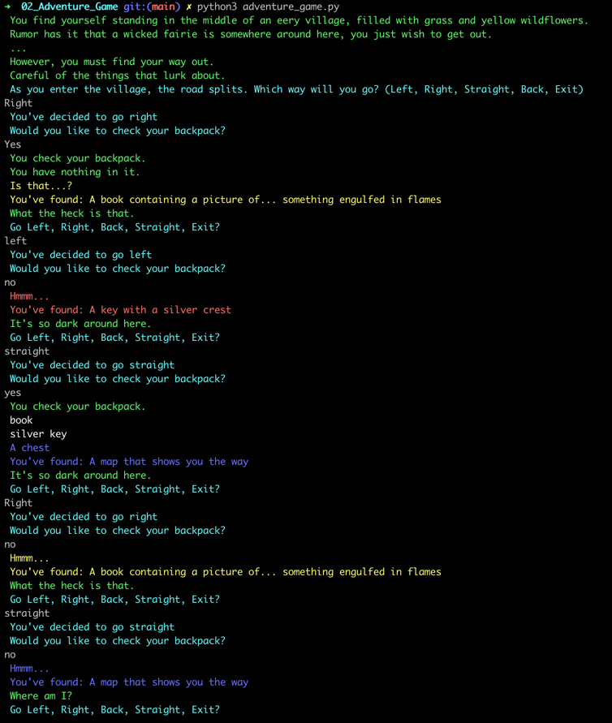

# Adventure Game

## Project Overview

The Adventure Game project is a part of the Udacity Front-End Web Developer Nanodegree, aimed at practicing and applying Python programming skills. This text-based adventure game provides an interactive story where players make choices that affect the outcome of the game. It is designed to demonstrate an understanding of Python basics, control structures, functions, and data structures.

### Features

**Interactive Story**: Engages the player with choices that dynamically alter the course of the adventure.
**Multiple Endings:** The game includes various possible endings based on the player's decisions throughout the game.
**Replayability:** Designed to encourage players to try different choices and explore all possible outcomes.

#### Technologies Used

* Python 3

#### Project Structure

```
02_Adventure_Game
│   README.md
│   adventure_game.py
```

#### Getting Started

**Prerequisites**
Python 3 installed on your local system. You can download it from python.org.

**Running the Game**
Clone the repository to your local machine.
```
git clone https://github.com/amnotme/Udacity_FEND.git
```
Navigate to the 02_Adventure_Game directory.
Run the game using Python.
```
python3 adventure_game.py
```
**How to Play**
1. Start the game as instructed above.
2. Read the story prompts and make choices by entering the corresponding number for your chosen action.
3. Your choices will lead you through different paths, ultimately leading to various endings.
4. To explore different outcomes, play the game multiple times with different choices.

#### In-Game 




#### Customization

To customize your adventure game or add new features:

**Edit adventure_game.py**: Modify the story, add new choices, or alter the game logic.
**Enhance Interactivity**: Implement additional features such as inventory management, combat systems, or character stats.
**Expand the Story**: Add new paths, endings, or characters to enrich the game experience.