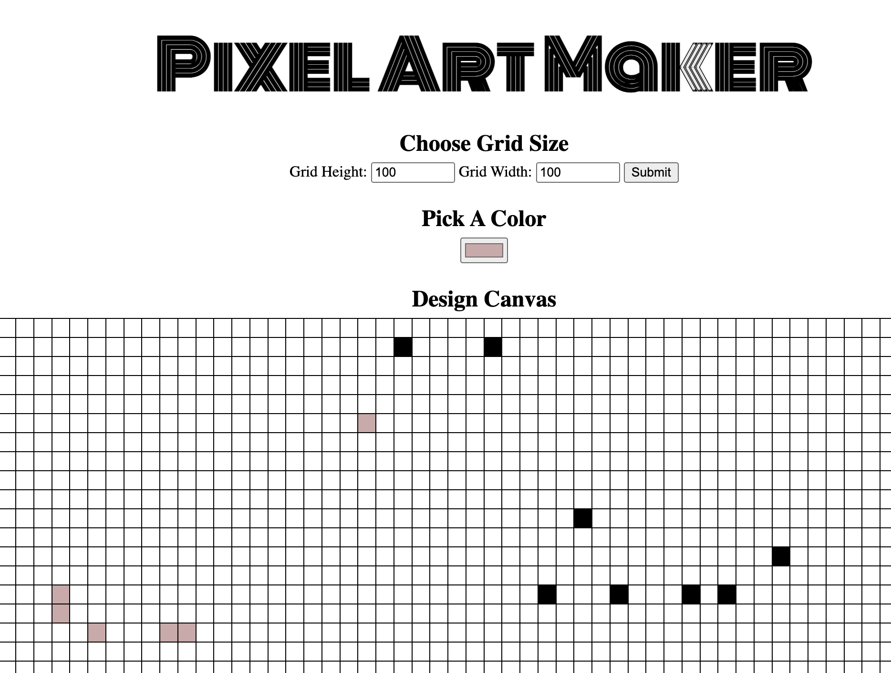

# Pixel Art Maker

## Project Overview

The Pixel Art Maker project is a creative component of the Udacity Front-End Web Developer Nanodegree, designed to test and apply knowledge of JavaScript, HTML, and CSS. This interactive web application allows users to design pixel art on a customizable canvas. Users can select colors and click or drag over the grid to create images, making it an engaging way to demonstrate understanding of DOM manipulation and event handling.

### Features

**Customizable Canvas Size:** Users can specify the width and height of the pixel canvas.
**Color Selection:** A color picker allows for easy selection of the desired paint color.
**Interactive Drawing:** Clicking and dragging over the canvas grid colors the pixels, enabling the creation of intricate designs.
**Reset Functionality:** Users can clear their artwork and start anew with a blank canvas.

#### Technologies Used

* HTML5
* CSS3
* JavaScript

#### Project Structure

```
03_Pixel_Art_Maker
│   README.md
│   index.html
│   design.js
│
│   style.css
│   [Project Screenshots and Assets]
```
#### Pixel Art Maker



#### Getting Started

**Prerequisites**
A modern web browser with JavaScript enabled.
**Installation and Setup**
Clone the repository to your local machine.
```
git clone https://github.com/amnotme/Udacity_FEND.git
```
Navigate to the 03_Pixel_Art_Maker directory.
Open index.html in your web browser to start using the Pixel Art Maker.
**Usage**
**Set Canvas Size:** Enter the desired width and height for the grid and click the "Submit" button to create a blank canvas.
**Select Color:** Use the color picker to choose a color.
**Draw:** Click and drag over the grid cells to color them.
**Reset:** Click the "Submit" button again with new dimensions to reset the canvas and start a new project.

#### Customization

Consider these ideas to customize and enhance the Pixel Art Maker:

**Save and Load Functionality:** Implement features allowing users to save their creations and load them later.
**Advanced Coloring Options:** Add options for more complex coloring, such as fill areas or use gradients.
**User Accounts:** Create a system for users to create accounts and save their artwork to their profile.