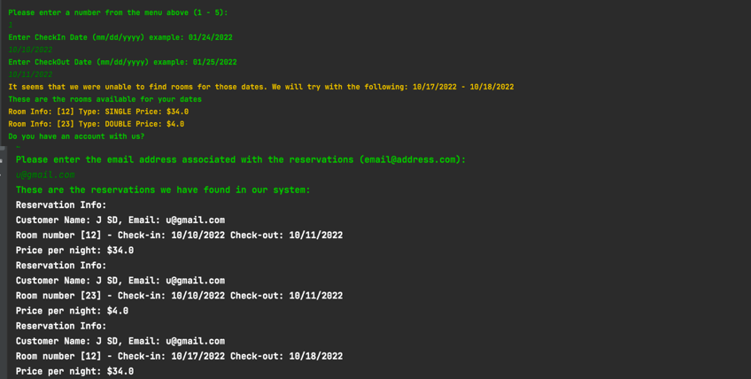

# Hotel Reservation Application

## Project Overview

The Hotel Reservation application is a Java-based project designed to simulate a basic hotel booking system. As part of the Udacity Front-End Web Developer Nanodegree, this project demonstrates proficiency in Java programming, focusing on object-oriented programming principles, data handling, and user interaction through the console. Users can add customers, create reservations, and view bookings in a simplified hotel reservation system.

### Features

**Customer Management:** Add new customers to the hotel reservation system.
**Room Management:** Ability to add rooms and view all available rooms.
**Reservation System:** Create reservations for customers with available rooms.
**View Reservations:** List all reservations and the rooms booked by a particular customer.

#### Technologies Used

Java

#### Project Structure

```
04_Hotel_Reservation
│   README.md
└───src
    │───api
    │───helper
    │───interfaces
    │───main
    │───model
    │───service
    │───view
└───JavaDocs
    │   [Java Documentation Files]
```
#### Hotel Reservation UI


#### Getting Started

**Prerequisites**
* JDK 11 or later installed on your machine.
* An IDE that supports Java development (e.g., IntelliJ IDEA, Eclipse, or Visual Studio Code).

#### Installation

Clone the repository to your local machine.
```
git clone https://github.com/amnotme/Udacity_FEND.git
```
* Navigate to the 04_Hotel_Reservation directory.
* Open the project in your IDE.

**Running the Application**

* Compile the Java source files in your IDE.
* Run Main.java to start the application.
* Follow the on-screen prompts to interact with the hotel reservation system.

#### Usage

**Add Customer:** Input customer details as prompted to add them to the system.
**Add Room:** Input room details to add rooms available for booking.
**Create Reservation:** Select a customer and available room to create a reservation.
**View Reservations:** Choose to view all reservations or search for reservations by a specific customer.

#### Customization

To further develop or customize the application:

**Expand Functionality:** Add features such as room types, pricing, or date ranges for bookings.
**Improve User Interface:** Implement a graphical user interface (GUI) using JavaFX or Swing.
**Optimize Data Storage:** Implement data persistence using file storage or a database to save and retrieve reservations.