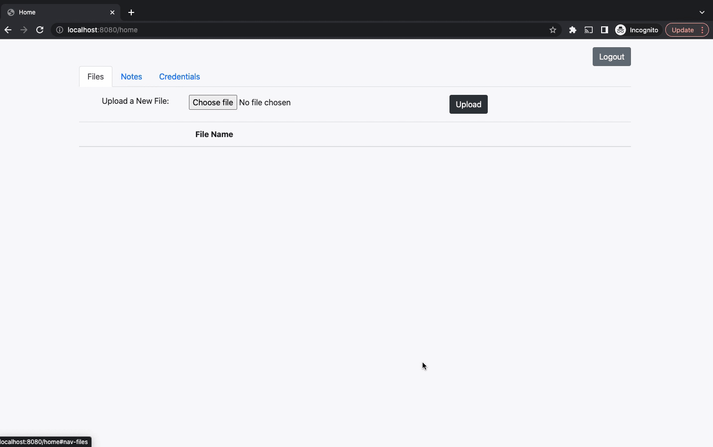
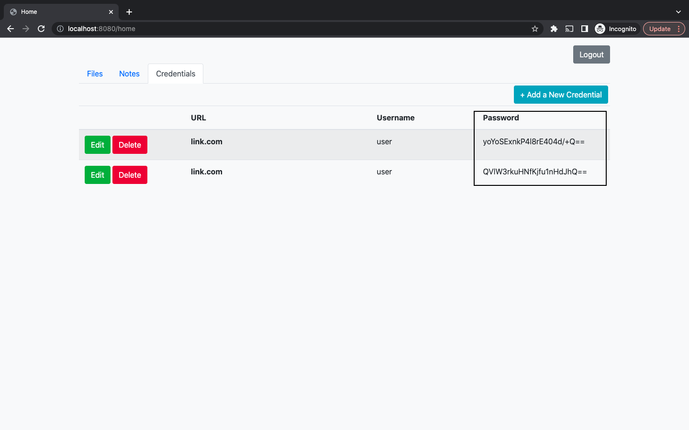
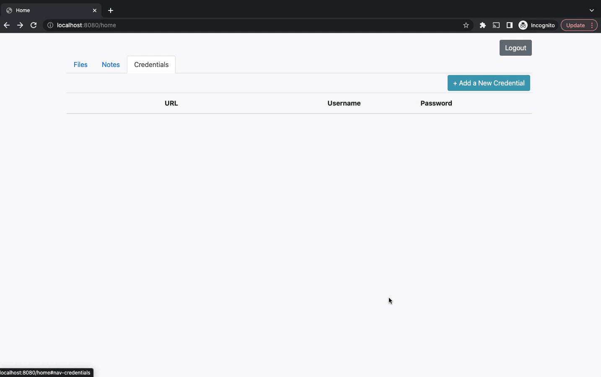
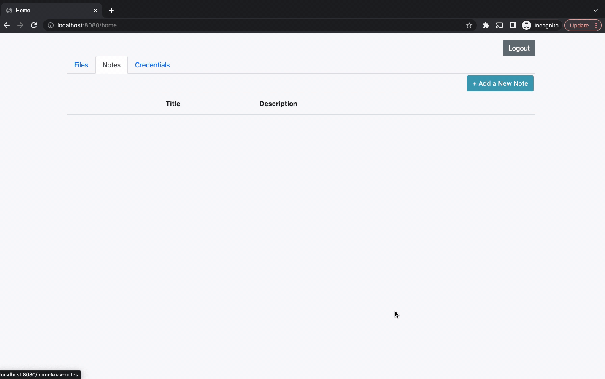
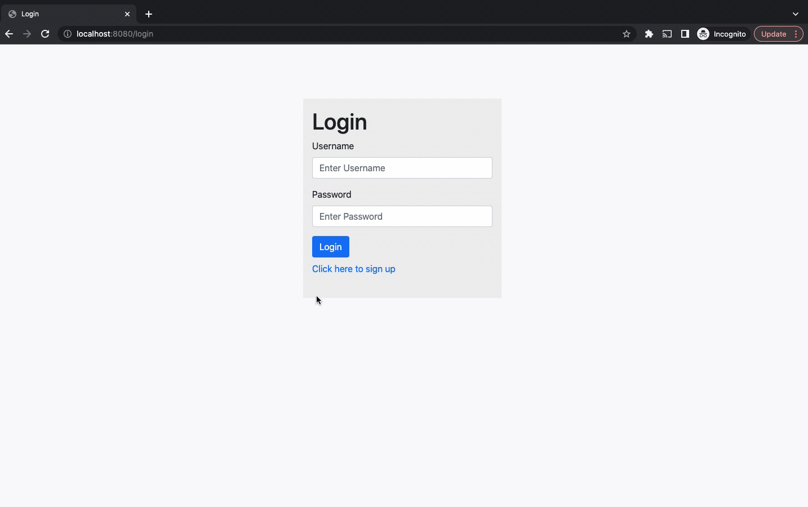

# Super*Duper*Drive Cloud Storage Description

## Project Overview

Super Duper Drive is a cloud storage application developed as part of the Udacity Front-End Web Developer Nanodegree. This Java-based web application allows users to securely store, retrieve, and manage their files, notes, and credentials. Utilizing Spring Boot for the backend and Thymeleaf for the frontend, Super Duper Drive showcases a full-stack development approach with an emphasis on security and user-friendly design.

### Features

**File Storage:** Users can upload files to their personal space, download them, or remove them.
**Notes Management:** Users can add, edit, or delete textual notes.
**Credentials Management:** Secure storage for website credentials with the ability to view, add, edit, or delete entries. Passwords are encrypted before storage.
**User Authentication:** Secure login and signup functionalities with Spring Security.

#### Technologies Used

* Java
* Spring Boot
* MyBatis
* H2 Database
* Thymeleaf
* Bootstrap

#### Project Structure

```
06_Super_Duper_Drive
│   README.md
│   pom.xml
│
└───src
│   └───main
│       └───java
│           └───com
│               └───udacity
│                   └───superduperdrive
│                       │   [Java Source Files]
│       └───resources
│           │   application.properties
│           └───static
│           └───templates
│
└───test
    │   [JUnit Test Files]
```
#### Super Duper Drive










#### Getting Started

**Prerequisites**
* JDK 11 or later.
* Maven.

#### Installation

Clone the repository to your local machine.
```
git clone https://github.com/amnotme/Udacity_FEND.git
```
* Navigate to the 06_Super_Duper_Drive directory.
* Run Maven to install dependencies and build the project.
```
mvn clean install
```

#### Running the Application

After building the project, run the application using Maven.
```
mvn spring-boot:run
```
Access the web application at http://localhost:8080.

#### Usage

**Sign Up:** Create a new account by providing a username, password, and your personal details.
**Log In:** Access the application using your credentials.
**Dashboard:** Once logged in, use the navigation tabs to switch between files, notes, and credentials management.

#### Customization

**Extend Functionality:** Consider adding new features such as sharing files between users, adding file tags for organization, or integrating cloud storage solutions like AWS S3.
**Improve UI/UX:** Enhance the frontend with more advanced frameworks like Angular or React, and improve the user experience with AJAX for dynamic content updates.
**Scale the Application:** Refactor the application to use a more scalable database solution and deploy on cloud platforms like AWS or Azure for greater accessibility and reliability.